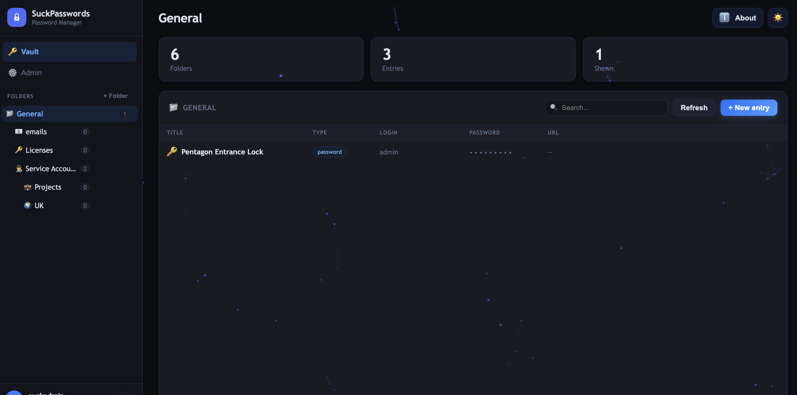
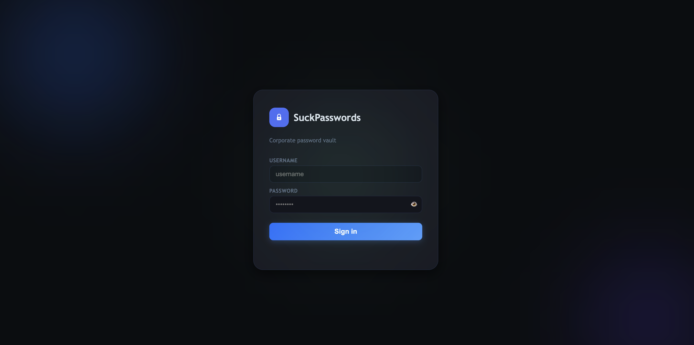

# SuckPasswords

A self-hosted corporate password vault with a web UI, LDAP/AD authentication, role-based access control, and AES-256-GCM encrypted storage.

## Features

- **HTTPS only** — nginx reverse proxy with TLS 1.2/1.3
- **LDAP / Active Directory** auth with group membership check and auto-provisioning
- **3-tier RBAC** — General, DomainAdmin, EnterpriseAdmin entry levels
- **Folder tree** with drag-and-drop organisation
- **Entry types** — Password, SSH, API token
- **Password generator** and weak-password detection
- **AES-256-GCM** encryption for stored secrets
- **Encrypted backup / restore** (`.spbackup` files)
- **CSV import / export**
- **Inactivity auto-logout** after 5 minutes
- **Account lockout** after 5 failed login attempts (unlocks after 15 min)
- **Brute-force rate limiting** on the login endpoint (nginx)
- Dark / light theme

## Screenshots

<p align="center">
    
</p>

| Login | Main Vault |
|---|---|
|  |  |

## Architecture

```
Browser → nginx :443 (HTTPS) → FastAPI :8000 → PostgreSQL
```

- **nginx** — TLS termination, security headers, rate limiting
- **backend** — FastAPI + SQLAlchemy 2.0, JWT auth, bcrypt passwords
- **db** — PostgreSQL 16

## Quick Start

### 1. Clone and enter the directory

```bash
git clone git@github.com:aleshenkow/suckpasswords.git
cd suckpasswords
```

### 2. Configure environment

```bash
cp .env.example .env
```

Edit `.env` and set strong values for at minimum:

| Variable | Description |
|---|---|
| `POSTGRES_PASSWORD` | PostgreSQL password |
| `APP_SECRET_KEY` | JWT signing key (32+ random chars) |
| `APP_DATA_ENCRYPTION_KEY` | Entry encryption key (32+ random chars) |
| `APP_ADMIN_PASSWORD` | Initial admin password |

### 3. Generate a dev TLS certificate

```bash
cd certs && chmod +x generate-dev-cert.sh && ./generate-dev-cert.sh && cd ..
```

For production, replace `certs/server.crt` and `certs/server.key` with certificates from a trusted CA.

### 4. Start

```bash
docker compose up -d --build
```

Open **https://localhost:8888** in your browser.

> The self-signed certificate will trigger a browser warning — accept it for local dev, use a real cert in production.

## Admin account

On **first startup**, the application creates the initial admin account using the credentials you provide in `.env`:

```dotenv
APP_ADMIN_USERNAME=your_admin_username
APP_ADMIN_PASSWORD=your_strong_admin_password
APP_ADMIN_EMAIL=admin@local       # optional
```

> If `APP_ADMIN_USERNAME` or `APP_ADMIN_PASSWORD` is empty and no admin user exists yet, the application will refuse to start with a clear error message.

Once the account is created the env variables are no longer used for login — you can clear them from `.env` if you prefer.

## LDAP / Active Directory

Set the following variables in `.env`:

```dotenv
AD_ENABLED=true
AD_SERVER_URI=ldaps://dc.example.local:636
AD_BASE_DN=DC=example,DC=local
AD_BIND_DN=CN=svc-bind,OU=ServiceAccounts,DC=example,DC=local
AD_BIND_PASSWORD=your_bind_password
AD_USER_FILTER=(sAMAccountName={username})
AD_REQUIRED_GROUP_DN=CN=VaultUsers,OU=Groups,DC=example,DC=local
```

Authentication flow:
1. If a local (`source=local`) user exists → local password check.
2. Otherwise → LDAP bind/search using the configured filter.
3. On success, a local profile is created automatically (if auto-provisioning is enabled).

LDAP settings can also be managed from the Admin → LDAP tab in the UI.

## Security notes for production

- Use certificates from a trusted CA (Let's Encrypt, internal PKI, etc.)
- Set strong, unique values for `APP_SECRET_KEY` and `APP_DATA_ENCRYPTION_KEY`
- Restrict access to port `8888` via firewall or VPN
- Store `.env` outside the repository and never commit it
- Rotate secrets and backup encryption keys on a schedule
- Review backup files — they contain all vault entries encrypted with the backup password

## Project structure

```
suckpasswords/
├── docker-compose.yml
├── .env.example
├── nginx/nginx.conf
├── certs/generate-dev-cert.sh
└── backend/
    ├── Dockerfile
    ├── requirements.txt
    └── app/
        ├── main.py       # API routes
        ├── models.py     # SQLAlchemy models
        ├── schemas.py    # Pydantic schemas
        ├── security.py   # JWT, bcrypt, Fernet helpers
        ├── config.py     # Settings from .env
        ├── database.py   # DB engine / session
        └── ui.html       # Single-page web UI
```

## API

Interactive docs available at **https://localhost:8888/docs** when the stack is running.

Key endpoints:

| Method | Path | Description |
|---|---|---|
| POST | `/auth/login` | Obtain JWT token |
| GET | `/users/me` | Current user info |
| GET/POST | `/folders` | List / create folders |
| GET/POST | `/entries` | List / create entries |
| PUT/DELETE | `/entries/{id}` | Update / delete entry |
| GET | `/password/generate` | Generate a random password |
| POST | `/admin/backup` | Create encrypted backup |
| POST | `/admin/restore` | Restore from backup |
| GET | `/admin/users` | List users (admin) |
| POST | `/admin/ldap` | Save LDAP config (admin) |

## License

MIT
